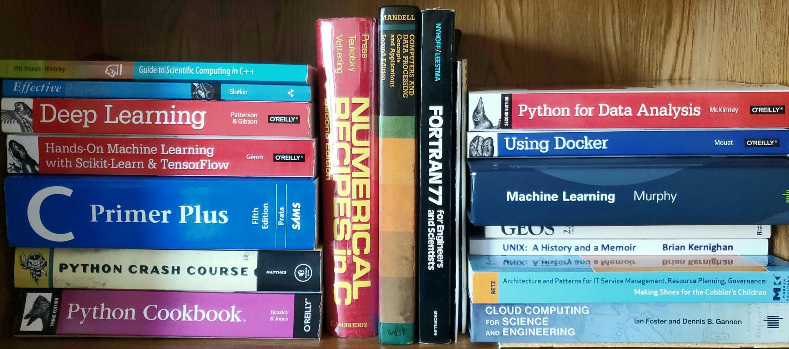

# My Favorite Machine Learning Resources (in no particular order)

September 6, 2020

[Home](../../../README.md) -- [Tutorials](../../../Tutorials/README.md) -- [Blog](../../README.md) -- [Textbook Summaries](../../../TextbookSummaries/README.md) -- [About Me](../../../aboutme.md) -- [Contact](../../../contactme.md) -- [Copyright](../../../copyright.md)

Machine learning is a rapidly expanding field and sometimes it can be difficult to find beginner resources to get introduced to the topics you are interested in.  When I first started getting into machine learning is was hard to find resources that both covered in detail the topic in which I was interested and were also written for someone with a beginner's knowledge of machine learning.  After about two years of researching a variety of topics related to machine learning, these are the resources that I have found to be the most helpful for someone getting started in the field.

## Books

### Machine Learning: A Probabilistic Perspective

By: Kevin Murphy

This is a textbook on machine learning, and as such its pretty technical and dense.  This is not the resource for a casual/practical user of machine learning, but if you are studying machine learning as a academic discipline this is a great resource to have (this is the textbook assigned in a lot of machine learning classes).  It's pretty math heavy and does not contain code examples, only algorithms in the form of pseudocode.  I would not recommend learning machine learning from this book but its a good resource to have if you want to go deeper into a topics.

* Link to the book on [Amazon](https://www.amazon.com/Machine-Learning-Probabilistic-Perspective-Computation/dp/0262018020/ref=sr_1_3?keywords=machine+learning+murphy&qid=1558358280&s=books&sr=1-3)

### The Elements of Statistical Learning

This is another book that is great if you are studying machine learning in college or graduate school, but it is pretty heavy in the mathematics.  Even though this book is over fifteen years old, it is still relevant today.  It provides a very through explanation of many supervised learning algorithms including regression, neural networks, and support vector machines.  This book does not include code examples, but some of the end of chapter problems involve writing codes to implement the theories learned.  Again, I would not recommend this book to someone just beginning to learn about machine learning, but this is a great book for learning the intricate details of various machine learning algorithms.  However, you will get the most out if it if you are comfortable with the more advanced mathematics (linear algebra and multivariable calculus).

* Link to the book on[Amazon](https://www.amazon.com/Elements-Statistical-Learning-Prediction-Statistics-dp-0387848576/dp/0387848576/ref=mt_other?_encoding=UTF8&me=&qid=1599334255).
* A PDF copy of the book is provided free by the authors.  It can be found [here](https://web.stanford.edu/~hastie/Papers/ESLII.pdf).
* The book's [website](https://web.stanford.edu/~hastie/ElemStatLearn/).

### Hands-on Machine Learning with Scikit-Learn and Tensorflow

By: Aurélien Géron

This is the reference book for the people who are not learning machine learning as a academic discipline, but rather for practical reasons.  It's a great combination of explanations and code examples (with even more code examples online) plus just enough math to introduce more technical aspects of machine learning without making it overly complicated.  The codes in the book are written using Scikit-Learn and Tensorflow, which are two of the main Python libraries used in the machine learning field.  The book is written so that you could read through the entire book (which you should do if you are trying to learn machine learning as a whole), or you can just pick and choose which chapters you want to read if you are only interested in a few topics.  This was actually assigned in my graduate level Applications of Machine Learning class. 

* Link to the book on [Amazon](https://www.amazon.com/Hands-Machine-Learning-Scikit-Learn-TensorFlow/dp/1491962291).
* [Code examples](https://github.com/ageron/handson-ml) provided by the author.

## Web Resources

### Medium.com

Machine learning is a field that is evolving extremely rapidly, and as such printed material cannot keep up with all of the new innovations.  Because of this, some of the best platforms to get updated information in machine learning are blogs and websites.  Medium is an online publishing platform that hosts several blogs that are dedicated to machine learning and data science.  Among the ones I read the most are [Data Science Bootcamp](https://medium.com/data-science-bootcamp) and [Towards Data Science](https://towardsdatascience.com/).  Another recommended blog is [Better Programming](https://medium.com/better-programming) which has many useful articles on how to write better code, even if they are not necessarily related to machine learning.  Medium has articles that cover a wide range of topics and knowledge levels so you are sure to be able to find an understandable article on any topic you want, no matter what your past experience with coding and machine learning are.  A couple recommended articles would be [this](https://medium.com/data-science-bootcamp/multilayer-perceptron-mlp-vs-convolutional-neural-network-in-deep-learning-c890f487a8f1) article from Data Science Bootcamp comparing multilayer perceptrons and convolutional neural networks and [this](https://towardsdatascience.com/how-to-build-your-own-neural-network-from-scratch-in-python-68998a08e4f6) article on coding a neural network from scratch from Towards Data Science.  Unfortunately, Medium does limit the number of articles you can view without a subscriptions, but if you find yourself using the site a lot a subscription is only $5 a month.

### Machine Learning Mastery

By: Jason Brownlee

This website is written by Jason Brownlee, who has a Ph.D. in artificial intelligence.  It has a bunch of great post of many different topics in machine learning, like this one on [recurrent neural networks](https://machinelearningmastery.com/recurrent-neural-network-algorithms-for-deep-learning/) and this one on [neural networks as function approximators](https://machinelearningmastery.com/neural-networks-are-function-approximators/).  Not only does he provide a through explanation of the topic, he also links relevant scientific articles and other resources that are really useful if you want to go deeper into a topic.  His website also includes tutorials, starting from [how to install everything](https://machinelearningmastery.com/setup-python-environment-machine-learning-deep-learning-anaconda/).  If you are brand new to machine learning, Brownlee's website is a pretty good place to start.

* Link the the blog's [homepage](https://machinelearningmastery.com/).

### A.I. Wiki

This website provides a lot of really useful beginner's guides to popular machine learning methods.  This is one of the best sources for someone who is brand new to machine learning.  On the website's [homepage](https://wiki.pathmind.com) they have links to several helpful resources for beginners including a comparison between artificial intelligence, machine learning, and deep learning, which can be found [here](https://wiki.pathmind.com/ai-vs-machine-learning-vs-deep-learning), and a [glossary of terms](https://wiki.pathmind.com/glossary) which contains much of the jargon that is common in artificial intelligence and machine learning.  All of their pages are written at a beginner's level and contain minimal math and code.  It's really geared towards helping you understand the concepts behind the machine learning algorithms, not getting caught up in the mathematics or implementations.  However, they do link many outside resources at the end of the articles, many of which go more in depth into the mathematics or the coding.

* Link to the [homepage](https://wiki.pathmind.com).

## Other 
## A high-bias, low-variance introduction to Machine Learning for physicists

By: Pankaj Mehta et. al.

Exactly as the title claims, this is a review of machine learning written by physicists for other physicists.  It does not assume any prior knowledge of machine learning so it explains everything from the most basic concepts.  However, its examples are drawn from physics so if you do not have a good knowledge of physics some of the examples may be a bit confusing.  However, the explanations of machine learning concepts do not need a knowledge of physics and are super understandable.  This is a rather long PDF at over 100 pages, but it throughly covers must topics in machine learning besides reinforcement learning and provides some excellent references as well.  Another great thing about this paper is that it provides open-source code to go along with it so you can get hands-on practice on the topics you are reading about.
* A PDF of the review can be found [here](https://arxiv.org/pdf/1803.08823.pdf).
* The accompanying code can be found [here](https://physics.bu.edu/~pankajm/MLnotebooks.html).
