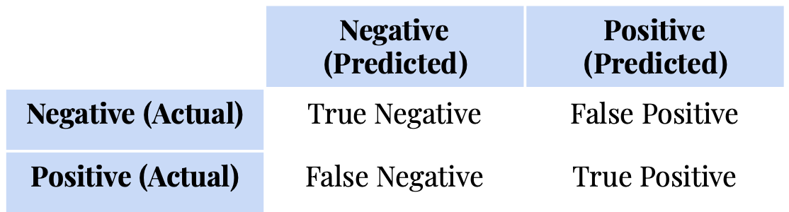
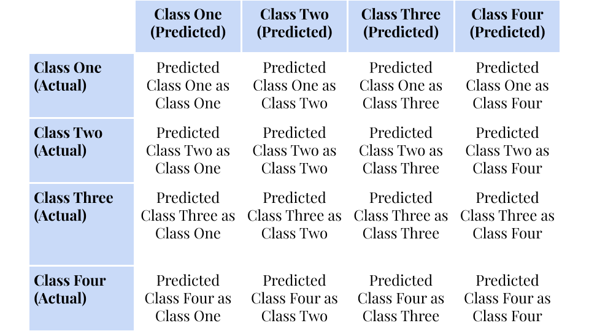
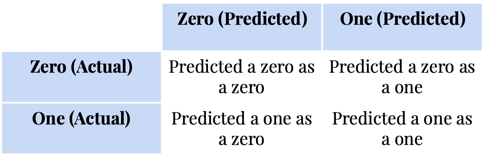
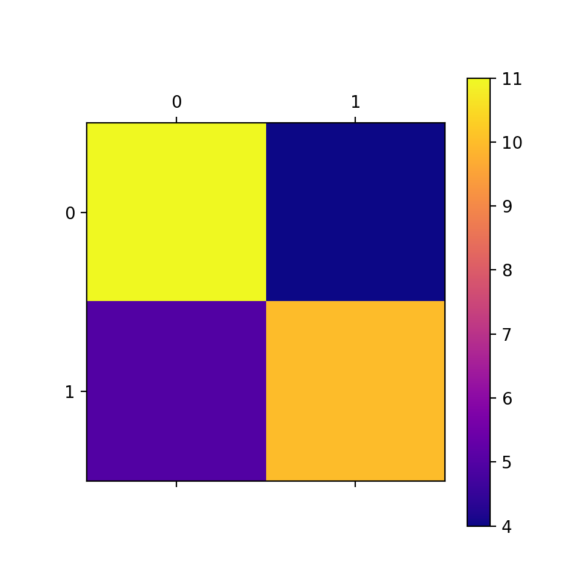
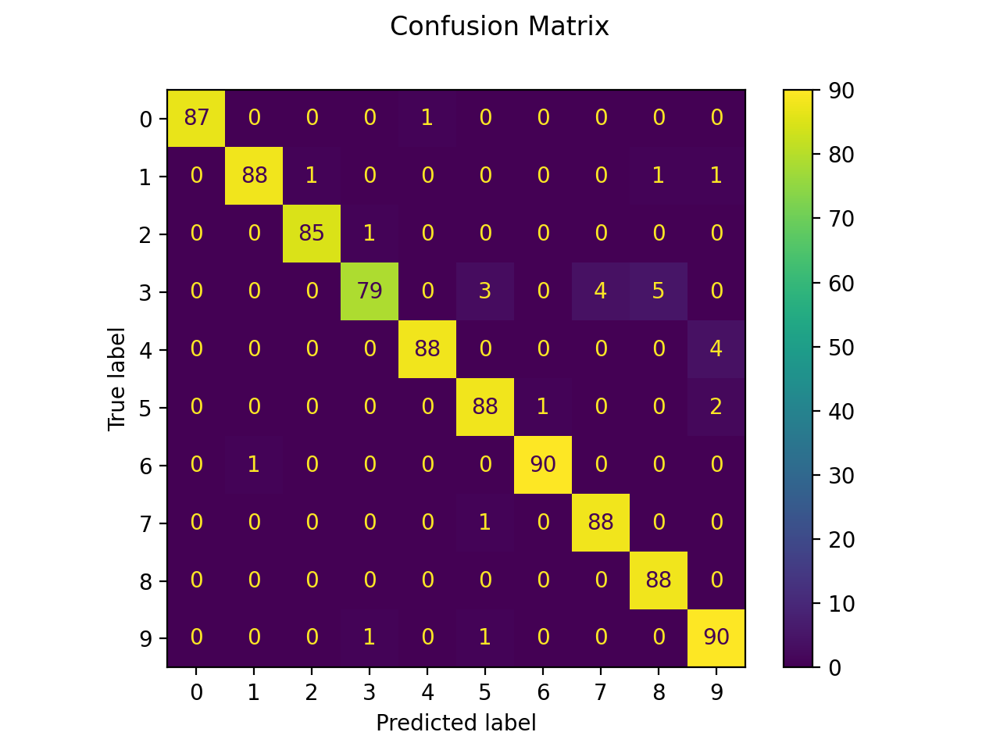

# Confusion Matrix: A Measure of Classifier Performance

[Home](../../README.md) -- [Tutorials](../../Tutorials/README.md) -- [Blog](../../Blog/README.md) -- [About Me](../../aboutme.md) -- [Contact](../../contactme.md) -- [Resume](../../Resume.pdf) -- [Copyright](../../copyright.md)

November 2, 2020

## What is a confusion matrix?

A confusion matrix is a way to evaluate the performance of a classifier by visualizing how many times the classifier correctly predicted a classification and how many times a classification was incorrectly predicted.  It uses a matrix to show the how a classifier classifies each input.  It is useful to determine how many times the classifier is correct but also what types of mistakes the classifier is most likely to make.


## Confusion Matrix for a Binary Classifier
A binary classifier is a classifier that sorts the data into two classes.  Let's consider data that has the following two labels: "True" and "False".  The confusion matrix for this binary classifier would then look like this:



The correct classifications are on the diagonal of the matrix and the incorrect classifications are on the off diagonal of the matrix.  This means that the total number of correct classifications are the sum of the two numbers on the diagonal and the total number of incorrect classifications is the sum of the two numbers on the off diagonal.

## Confusion Matrix for a Multi-Class Classifier

A multi-class classifier is simply a classifier that sorts data into more than two classes.  As far as the confusion matrix goes, it follows the same format as the binary classifier, but it will be larger.  Let's consider a multi-class classifier that classifiers data into four classes: Class One, Class Two, Class Three, and Class Four.  The confusion matrix for this classifier will have the following form.



Just like with the binary classifier the diagonal elements represent the correct classifications and the off diagonal elements represent the incorrect classifications.  In addition the total number of correct classfications is still the sum of all elements on the diagonal and the total number of incorrect classifications is the sum of all of the off diagonal elements.


## Examples

### Example 1: Simple Binary Data

First, let's see how a confusion matrix works without using any machine learning algorithms.  We will do this by manually generating expected and predicted data sets.  For simplicity, let's generate what data could look like from a binary classifier with the classes "0" and "1".  The list "expected" contains the true classifications of the data while the list "predicted" contains the labels that would be generated by the machine learning algorithm.

```python
expected =  [0, 1, 1, 1, 0, 0, 1, 0, 1, 0, 1, 0, 1, 0, 1, 0, 1, 0, 0, 0, 1, 1, 1, 0, 1, 0, 1, 0, 1, 0]
predicted = [0, 0, 1, 0, 1, 0, 1, 1, 1, 0, 1, 0, 0, 0, 1, 0, 1, 1, 0, 0, 1, 0, 1, 0, 1, 1, 1, 0, 0, 0]
```

Next, let's examine how many 1's and 0's are in both of our data sets.  Ideally "expected" and "predicted" will contain  the same number of 0's and 1's, but in practice that is rarely the case.

```python
number_1s_expected = expected.count(1)
number_0s_expected = expected.count(0)
print ("Number of 1's expected: ", number_1s_expected)
print ("Number of 0's expected: ", number_0s_expected)

print()

number_1s_predicted = predicted.count(1)
number_0s_predicted = predicted.count(0)
print ("Number of 1's predicted: ", number_1s_predicted)
print ("Number of 0's predicted: ", number_0s_predicted)
```

Code Output:
```
Number of 1's expected:  15
Number of 0's expected:  15

Number of 1's predicted:  14
Number of 0's predicted:  16
```

From the above output we can see that the model predicts one less 1 than expected, but one more 0.  Ideally that means that one of the 1's got misclassified as a 0, which means that our algorithm only made one mistake.  However, analyzing the data like this can be misleading, as we will see below.

Let's import the confusion matrix method from Scikit-Learn.  This method takes two lists as arguments (the true values and the predicted values) and returns a confusion matrix.  Let's use this method to generate the confusion matrix and then print it to see what it looks like.

```python
from sklearn.metrics import confusion_matrix

CM = confusion_matrix(expected, predicted)

print(CM)
```
Code Output:
```
[[11  4]
 [ 5 10]]
```

In this form it is not entirely clear what the matrix means.  Let's take the confusion matrix from the binary classifier shown above and rewrite the labels in terms of this data set.



Now it is more clear what each of the numbers in the matrix means.  Ideally we would only have numbers on the diagonal and zeros on the off-diagonal elements, but that does not seem to be the case with this model.  For the zeros, 11 of the 15 true zeros are correctly classified as zeros, but four are classified as ones.  For the ones, 10 of the ones were correctly classified, but 5 were classified as zeros.  Let's explicitly print what each of the numbers in the matrix mean to be more clear.

```python
print("Number of zeros predicted as zeros: ",  CM[0][0])
print("Number of zeros predicted as ones: ", CM[0][1])

print ()

print("Number of ones predicted as zeros: ",  CM[1][0])
print("Number of ones predicted as ones: ", CM[1][1])
```

```
Number of zeros predicted as zeros 11
Number of zeros predicted as ones 4

Number of ones predicted as zeros 5
Number of ones predicted as ones 10
```

Based on the confusion matrix the total number of correct classifications will be the sum of all of the numbers on the diagonal and the number of incorrect classifications will be the sum of all other numbers in the matrix.  Let's print out these numbers for our model to see how it performs.

```python
print("Total number of correct predictions: ", CM[0][0] + CM[1][1])
print("Total number of incorrect predictins: ", CM[0][1] + CM[1][0])
```

```
Total number of correct predictions:  21
Total number of incorrect predictins:  9
```

The data set contains 30 numbers so 21/30 classifications were correct and 9/30 classifications were incorrect.  That means that we have a classification accuracy of 70%.  At the beginning of the example it seemed like there was only one misclassification, but now we can see there are 9.  This is a much more accurate way to investigate the accuracy of a classification algorithm.

Finally, let's investigate a common method for displaying confusion matrices, which is to use the matplotlib function matshow.  This function takes a matrix and displays it as a grid of squares.  Each square corresponds to one entry in the matrix.  The color of each square corresponds to the value of the matrix element.  For a small confusion matrix like this using matshow is a little bit overkill, but as we will see in the next example, it can be very beneficial for a multi-class classification problem.

```python
import matplotlib.pyplot as plt

plt.matshow(CM, cmap=plt.cm.plasma)
plt.colorbar()

plt.xticks([0, 1])
plt.yticks([0, 1])
```



## Example 2: MNIST Data Set

The MNIST data set is a fairly famous data set in machine learning that consists of images of handwritten numbers, 0-9.  It is commonly used as an example case for image classification algorithms.  Below is a sampling of entries in the MNIST dataset and you can read more about the MNIST data set in the image source link.


[Image Source](https://en.wikipedia.org/wiki/MNIST_database)

When using the MNIST data set a classifier is trained to look at one of the images and determine what digit is written in the image.  The algorithm then classifies the image into a class based on what digit it determines it contains.  This means that this is a multi-class classification problem with ten classes (digits range from 0 to 9).

The following code is drawn from the Scikit-Learn website and can be found [here](https://scikit-learn.org/stable/auto_examples/classification/plot_digits_classification.html).  The details of the code are not important for this example, but I will quickly explain what it does.  The following code trains a multi-class classifier, called a support vector classifier, on the MNIST data, and then uses the trained classifier to classify other members of the data set.  It then produces a confusion matrix to analysis the performance of the classifier on the test data.

```python
print(__doc__)

# Author: Gael Varoquaux <gael dot varoquaux at normalesup dot org>
# License: BSD 3 clause

# Standard scientific Python imports
import matplotlib.pyplot as plt

# Import datasets, classifiers and performance metrics
from sklearn import datasets, svm, metrics
from sklearn.model_selection import train_test_split

# The digits dataset
digits = datasets.load_digits()

# The data that we are interested in is made of 8x8 images of digits, let's
# have a look at the first 4 images, stored in the `images` attribute of the
# dataset.  If we were working from image files, we could load them using
# matplotlib.pyplot.imread.  Note that each image must have the same size. For these
# images, we know which digit they represent: it is given in the 'target' of
# the dataset.
_, axes = plt.subplots(2, 4)
images_and_labels = list(zip(digits.images, digits.target))
for ax, (image, label) in zip(axes[0, :], images_and_labels[:4]):
    ax.set_axis_off()
    ax.imshow(image, cmap=plt.cm.gray_r, interpolation='nearest')
    ax.set_title('Training: %i' % label)

# To apply a classifier on this data, we need to flatten the image, to
# turn the data in a (samples, feature) matrix:
n_samples = len(digits.images)
data = digits.images.reshape((n_samples, -1))

# Create a classifier: a support vector classifier
classifier = svm.SVC(gamma=0.001)

# Split data into train and test subsets
X_train, X_test, y_train, y_test = train_test_split(
    data, digits.target, test_size=0.5, shuffle=False)

# We learn the digits on the first half of the digits
classifier.fit(X_train, y_train)

# Now predict the value of the digit on the second half:
predicted = classifier.predict(X_test)

images_and_predictions = list(zip(digits.images[n_samples // 2:], predicted))
for ax, (image, prediction) in zip(axes[1, :], images_and_predictions[:4]):
    ax.set_axis_off()
    ax.imshow(image, cmap=plt.cm.gray_r, interpolation='nearest')
    ax.set_title('Prediction: %i' % prediction)

print("Classification report for classifier %s:\n%s\n"
      % (classifier, metrics.classification_report(y_test, predicted)))
disp = metrics.plot_confusion_matrix(classifier, X_test, y_test)
disp.figure_.suptitle("Confusion Matrix")
print("Confusion matrix:\n%s" % disp.confusion_matrix)

plt.show()
```

Among other information, the above code prints a confusion matrix for the trained classifier.  Since there are ten hand written numbers (0-9), the confusion matrix is a 10x10 matrix.  Though this is much larger than the example of a multi-class confusion matrix shown above, it displays its data in the same way, where the diagonal terms are the correct classifications and the off diagonal terms are the incorrect classifications.

```
Confusion matrix:
[[87  0  0  0  1  0  0  0  0  0]
 [ 0 88  1  0  0  0  0  0  1  1]
 [ 0  0 85  1  0  0  0  0  0  0]
 [ 0  0  0 79  0  3  0  4  5  0]
 [ 0  0  0  0 88  0  0  0  0  4]
 [ 0  0  0  0  0 88  1  0  0  2]
 [ 0  1  0  0  0  0 90  0  0  0]
 [ 0  0  0  0  0  1  0 88  0  0]
 [ 0  0  0  0  0  0  0  0 88  0]
 [ 0  0  0  1  0  1  0  0  0 90]]
```

Especially with a matrix this large it can be difficult to draw conclusions from just the numbers.  Luckily the above code also plots the confusion matrix with a colored grid, like in Example 1.  Below is the visualized confusion matrix produced by the code.



From the provided color bar we can see that the squares which are yellow correspond to a large number of classifications but the squares that are blue-purple correspond to a lower number of classifications.  Luckily, the classifier in the code is well trained and the yellow squares (large number of classifications) are only on the diagonal while the blue-purple squares (small number of classifications) are all on the off diagonal.

Ideally all of the off diagonal elements of the confusion matrix would be zero.  While this example is close to ideal, we can see that there are still some misclassifications.  Lets take a look at a couple of those misclassifications.  For example, it seems that the largest group of misclassifications occured when 5 threes were classified as eights (fourth row, ninth column).  This seems like a reasonable misclassification though because threes and eights can be written to look very similar.  Another misclassification seemed to mistake 4 fours as nines (fifth row, tenth column).  This again is an understandable mistake considering how close nines and fours can look at times.

While a classifier will likely never be 100% accurate, an analysis of the misclassifications can help improve the model.  With the model shown above there were very few misclassifications and the numbers that were misclassified were done so one understandable ways (fours mistaken as nines for instance).  This seems to indicate that the model is well trained.  For a model that was not well trained, we would see much larger off diagonal elements, and there would be groups misclassifications that would not seem understandable (for example a large number of threes classified as fours).

CONCLUSION


## References/Further Reading

1. https://wiki.pathmind.com/accuracy-precision-recall-f1
2. https://machinelearningmastery.com/confusion-matrix-machine-learning/
3. Hands-on Machine Learning with Sci-Kit Learn and Tensorflow by Aurélien Géron


# Copyright Notice
Confusion Matrix: A Measure of Classifier Performance
Copyright (C) 2020  Julie Hartley

This program is free software: you can redistribute it and/or modify
it under the terms of the GNU General Public License as published by
the Free Software Foundation, either version 3 of the License, or
(at your option) any later version.

This program is distributed in the hope that it will be useful,
but WITHOUT ANY WARRANTY; without even the implied warranty of
MERCHANTABILITY or FITNESS FOR A PARTICULAR PURPOSE.  See the
GNU General Public License for more details.

You should have received a copy of the GNU General Public License
along with this program.  If not, see <https://www.gnu.org/licenses/>.
