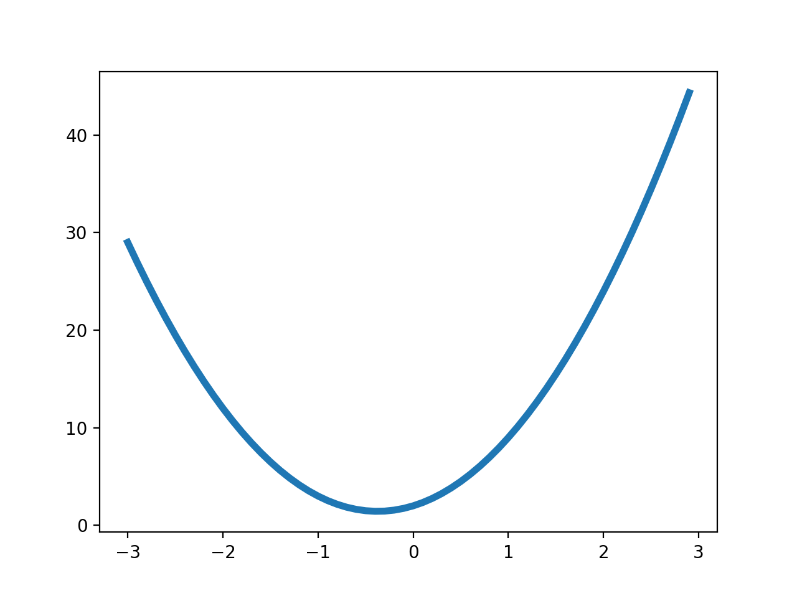
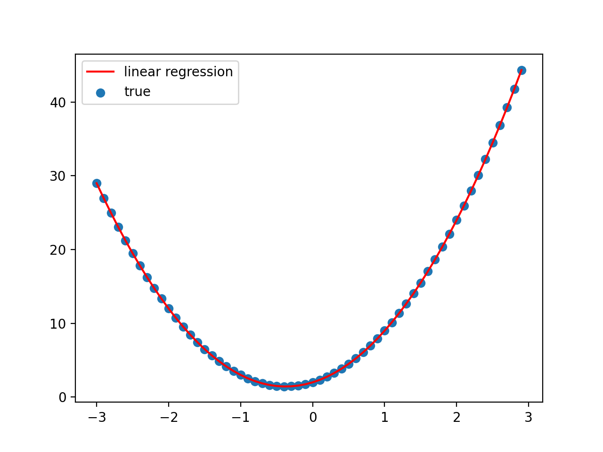



# Linear Regression: A Simple Introduction to Machine Learning

[Home](../../README.md) -- [Tutorials](../../Tutorials/README.md) -- [Blog](../../Blog/README.md) -- [About Me](../../aboutme.md) -- [Contact](../../contactme.md) -- [Resume](../../Resume.pdf) -- [Copyright](../../copyright.md)

November 25, 2020

## Introduction

Many machine learning courses and books start off with linear regression and there are a few reasons for this:
1. Linear regression is one of the most basic machine learning algorithms, but it contains all of the basic ingredients of a machine learning algorithm.
2. Linear regression has analytical expressions for its parameters, meaning you can find an equation that solves for the output of the algorithm.
3. Linear regression has a direct link to statistical interpretations.  Linear regression is also seen in statistics, though it may be called ordinary least squares.
4. Linear regression codes are easy to implement and can be solved numerically. In addition to introducing the algorithm, this tutorial will also go through the process of writing a simple linear regression code in Python.

Linear regression is typically used to fit data whose shape roughly corresponds to a polynomial, though using a design matrix (which will be covered later in this post), allows for a lot of flexibility.  Linear regression can also be used for classification.  For simplicity sake, let's assume we have the following data set and we want to find a function of the form y=ax2+bx+c which best fits the data using linear regression.  In order to do this the parameters a, b, and c need to be optimized in such a way to minimize the error between the predicted data set and the true data set.



## Creating the Equations

Considering the above example of fitting a quadratic, for each point in the data set, and assuming there are n total points, the linear regression algorithm needs to find parameters a, b, c so that:

y$$_0$$ = ax$$_0^2$$ + bx$$_0$$ + c

y$$_1$$ = ax$$_1^2$$ + bx$$_1$$ + c

y$$_2$$ = ax$$_2^2$$ + bx$$_2$$ + c
		.
		.
		.
y$$_{n-1}$$ = ax$$_{n-1}^2$$ + bx$$_{n-1}$$ + c

A system of equations like this can easily be rewritten to be represented by matrix-vector multiplication, which is how the output of a linear regression algorithm is formatted.  The output of a linear regression algorithm, represented by y with a caret on top (called a hat),  can simply be written as:

$$\hat{y} = X \theta $$

where $$\theta$$ is a vector of parameters that are optimized by the algorithm (which is why this method is machine learning) and X represents the input values and is known as the design matrix.

In this case, since we want to fit a quadratic, the design matrix for this problem will be:

 $$ X = \begin{bmatrix}
1 & x_0 & x_0^2 \\
1 & x_1 & x_1^2 \\
1 & x_2 & x_2^2 \\
. & . & . \\
. & . & . \\
. & . & . \\
1 & x_{n-1} & x_{n-1}^2 \\
 \end{bmatrix}$$

Note that these are the x terms from the system of equations in the above , with the leading one representing the x$$^0$$ (i.e. 1) term which is multiplied by the parameter c.  The vector $$\theta$$ would then be $$\theta$$ = [ a	b	c]$$^T$$.  The linear regression algorithm then optimizes the vector $$\theta$$ to make X$$\theta$$ as close to the true data as possible.

The best set of parameters are found using a loss function.  The loss function for the linear regression algorithm is simply the mean-squared error between the output of the linear regression algorithm and the true data.  This can be represented as:

$$J(\theta) = \frac{1}{n}\sum_{i=1}^n (\hat{y}_i - y_i)$$

Or in matrix-vector form as:

$$J(\theta) = \frac{1}{n}[(y-X\theta)(y-X\theta)]$$

The parameters are then optimized to minimize the error function (i.e. make the output of the linear regression equation as close to the true data as possible).  To find the values of $$\theta$$ that minimize the loss function, the derivative of the loss function with respect to $$\theta$$ needs to be taken:

$$\frac{\partial J(\theta)}{\partial \theta} = 0 = X^T(y-X\theta)$$

The derivative is set equal to zero to find the minimum of the loss function.  Finally, the above equation is solved for $$\theta$$ to find the optimized set of parameters:

$$\theta_{Linear} = (X^TX)^{-1}X^Ty$$

### Linear Regression Code

Combining everything together, we get the following code to find the parameters a, b, and c that fit the data set shown in the beginning.

```python
# Creating the input and output data
x = np.arange(-3, 3, 0.1)
y = 4*x**2+3*x+2
```

Next, we need to create the design matrix:

```python
# Creating the design matrix
# Creating the columns
first_col = np.ones(len(x))
second_col = x
third_col = x**2
# Make the matrix and tranpose to get into the correct
# shape
X = np.matrix([first_col, second_col, third_col])
X = np.transpose(X)
```

The columns are ones, x, and x$$^$$2 as shown in the design matrix equation derived previously.  After creating the matrix, it needs to be transposed to be in the proper form.

Finally, using the equation for the optimized parameters that was derived earlier, we can find the optimal parameters a, b, and c to fit the data set:

```python
# Finding the optimized parameters and reshaping
theta = np.linalg.inv(np.transpose(X)@X)@np.transpose(X)@y
theta = np.asarray(theta).flatten()
# Extract the optimized parameters
c = theta[0]
b = theta[1]
a = theta[2]
```

The expression for theta is a bit complicated, but it is simply the equation derived earlier.  The @ symbols perform matrix-matrix or matrix-vector multiplication.  After theta is created it needs to be formatted using the ‘asarray’ and ‘flatten’ statements so the parameters can be extracted.  The resulting parameters a, b, and c are as follows, which are almost exactly the parameters used to make the data set.

```
Parameter c:  2.0000000000000018
Parameter b:  3.000000000000001
Parameter a:  4.000000000000002
```

Finally, let’s plot the true data set against the linear regression result to see how it performs:

```python
# Plot the true data
plt.scatter(x, y, label="true")
# Plot the equation from the linear regression parameters
plt.plot(x, c+b*x+a*x**2, 'r', label="linear regression")

plt.legend()
plt.show()
```



It is an exact match for the data!  While this is a rather simple data set, so a good match is expected, the same algorithm can be applied to more complex data sets as well, as long as the design matrix is changed to be a good fit for the data.  If you are unsure what design matrix to use a good starting place would be the [Vandermonde matrix](https://en.wikipedia.org/wiki/Vandermonde_matrix).

## Conclusion

The main takeaway from this post is that linear regression, a type of machine learning, does not come up with its results using some magic, black-box code.  It's actually a rather simple set of equations that are easy to derive and calculate by hand.  While other machine learning algorithms are more complicated, all supervised learning algorithms at their core are some combination of matrix multiplication and derivative optimization.  My goal over the next few weeks is to cover a variety of machine learning algorithms in the hopes of debunking the myth that machine learning is complicated magic.


## References/Further Reading 
1. Hands-on Machine Learning with Sci-Kit Learn and Tensorflow by Aurélien Géron
2. https://compphysics.github.io/MachineLearning/doc/web/course.html (Weeks 34 and 35)

# Copyright Notice
Linear Regression: A Simple Introduction to Machine Learning

Copyright (C) 2020  Julie Hartley

This program is free software: you can redistribute it and/or modify
it under the terms of the GNU General Public License as published by
the Free Software Foundation, either version 3 of the License, or
(at your option) any later version.

This program is distributed in the hope that it will be useful,
but WITHOUT ANY WARRANTY; without even the implied warranty of
MERCHANTABILITY or FITNESS FOR A PARTICULAR PURPOSE.  See the
GNU General Public License for more details.

You should have received a copy of the GNU General Public License
along with this program.  If not, see <https://www.gnu.org/licenses/>.
